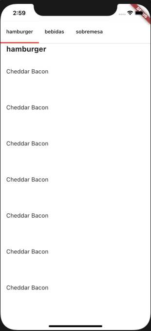

# Listagem Inteligente

Esse projeto é um desafio onde é construído o scroll muito simular ao usado no app do [ifood](https://www.ifood.com.br/?gclid=Cj0KCQjw8vqGBhC_ARIsADMSd1ADm8jU71cXGGXPbQSPj4EInvs_AxIUsbR1RWDwp0U_8SfA1j7vnsMaAnENEALw_wcB).

## Descrição

Desafio de uam listagem que envia dados da sua posição atual na tela, e pode ser navegada por uso de botões, tudo isso em flutter. A construção desse projeto está disponível no instagram. E todas as minhas redes estão abaixo para esclarecimento de dúvidas.

  

  

  

  